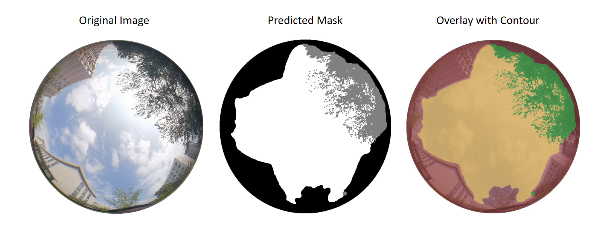

# High-Precision Three-Class Fisheye Sky Image Dataset

This dataset provides **high-precision three-class fisheye sky images**, 

specifically designed for **sky segmentation** and **visual-assisted GNSS NLOS/LOS satellite identification** research

in complex urban environments. 

It introduces a more refined distinction of occlusions beyond traditional binary classification, 

making it suitable for applications such as autonomous driving, UAV positioning, and augmented reality.

------

## 1. Dataset Overview

In dense urban environments, obstacles such as buildings and trees can block satellite signals, 

leading to **GNSS multipath effects and non-line-of-sight (NLOS) errors**.

To support **fine-grained scene understanding research**, 

we have constructed a **high-precision fisheye sky image dataset** with three semantic labels:

- **Sky Region**: Visible sky areas
- **Building Occlusion**: Rigid structures such as buildings and bridges
- **Vegetation Occlusion**: Semi-transparent obstacles such as trees and shrubs

This dataset is suitable for training and evaluating **deep learning-based multi-class semantic segmentation models**, 

such as **DeepLab series, HRNet, SegFormer**, etc.

------

## 2. Data Collection Setup
Collection scenarios include:

- **High-density skyscraper canyon areas**
- **Tree-lined streets with dense foliage**
- **Semi-open plazas and mixed-structure areas**


All images were collected using the following equipment:

- **Smartphone equipped with a low-cost wide-angle fisheye lens**
- **Custom rigid mounting platform** to ensure a stable upward-facing perspective
- Coverage of various urban environments with different sky visibility conditions


------

## 3. Data Structure

The dataset directory structure is as follows:

```
.
├── train/                   # Training set
│   ├── raw_images/          # Training images
│   │   ├── 0001.jpg
│   │   ├── 0002.jpg
│   │   └── ...
│   └── mask_images/         # Training set annotations
│       ├── 0001.png
│       ├── 0002.png
│       └── ...
│
└── val/                     # Validation set
    ├── raw_images/          # Validation images
    │   ├── 1001.jpg
    │   ├── 1002.jpg
    │   └── ...
    └── mask_images/         # Validation set annotations
        ├── 1001.png
        ├── 1002.png
        └── ...
```

## 4. Annotation Format

The mask images are in **single-channel PNG format**:

- **White (pixel value = 255)** → Sky region
- **Black (pixel value = 0)** → Building occlusion
- **Gray (pixel value = 128)** → Vegetation occlusion

Annotation workflow:

- Manual fine annotation of building edges
- Semi-automatic extraction of vegetation regions
- Multiple rounds of quality inspection and correction

Annotations ensure **high-precision boundary delineation**, 

especially in challenging areas such as **building edges** and **vegetation gaps**.

------

## 5. Data Samples

Examples of original images and their corresponding three-class masks:



------

## 6. Application Scenarios

This dataset is suitable for the following research directions:

- Fisheye image sky segmentation
- Visual-assisted GNSS **NLOS/LOS satellite detection**
- Urban sky visibility and satellite availability analysis
- Benchmarking segmentation models under fisheye distortion

------

## 7. Related Literature

If this dataset is used in your research, please cite:

**"Smartphone Fisheye Camera Sky Segmentation and GNSS NLOS Satellite Identification Using Spatio-Temporal Attention Enhanced U-Net"**

(Full citation information will be updated upon formal publication)

------

## 8. Usage License

This dataset is for **academic research purposes only**.

For **commercial applications**, please contact the author for authorization.

------

## 9. Note on Current Release

**Note:** The current version showcases 50 training samples and 10 validation samples. 

The complete dataset will be released upon the formal publication of the associated paper.